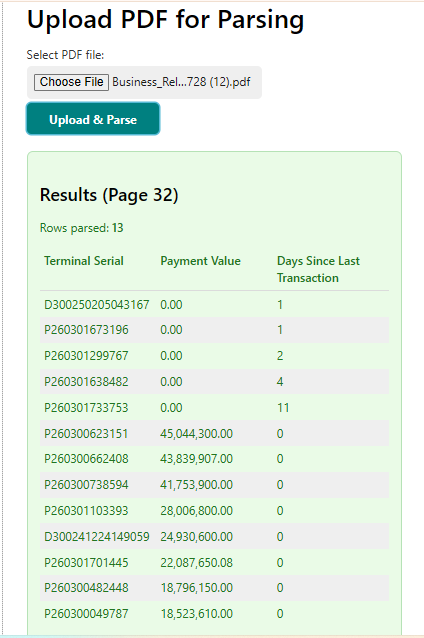

# PDF Parser API (Flask + pdfplumber)

## Overview

A simple backend service in Python (Flask) that:

- Accepts a PDF upload over HTTP (`POST /parse`)
- Parses the first page in the PDF where the header starts with **"Weekly Terminal Transactions"** (case-insensitive, ignores extra spaces)
- Extracts only these columns from each row in the table:
  - **Terminal Serial**
  - **Payment Value**
  - **Days Since Last Transaction**
- Returns the extracted data as JSON:

```json
{
   "page_number": 32,
   "count": 13,
   "data": [
      {
         "Terminal Serial": "P260301190391",
         "Payment Value": "2,819,280.00",
         "Days Since Last Transaction": "0"
      },
      ...
   ]
}
```

---

## What We've Achieved So Far

- **Backend:**

  - Built with Flask and pdfplumber
  - `/parse` endpoint accepts PDF uploads and returns parsed data as JSON
  - `/health` endpoint for health checks
  - CORS enabled for frontend integration
  - Uploads limited to 15MB
  - Robust regex-based table extraction

- **Frontend:**
  - Simple HTML/Vanilla JS upload form (styled with water.css)
  - Uploads PDF to backend and displays parsed results in a styled table
  - User feedback for errors, info, and success

**Sample Result:**


---

## Backend Details

- Flask as the web framework
- flask-cors for CORS
- pdfplumber for PDF parsing
- Regex for table extraction
- `/health` endpoint returns `{ "status": "ok" }`

## Frontend Plan

- Upload a PDF
- Call the API
- Display returned data in a table
- Optionally download results as JSON/CSV

## Future Improvements

- Allow scanning all pages, not just the first match
- Handle more complex tables (multi-line Business Names, etc.)
- Add authentication for production
- Add pagination and CSV/Excel export
